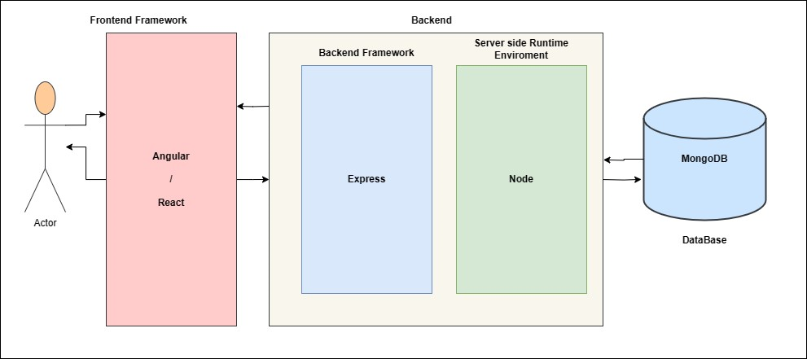
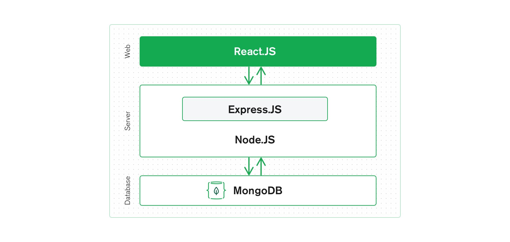
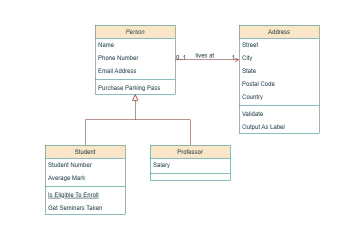
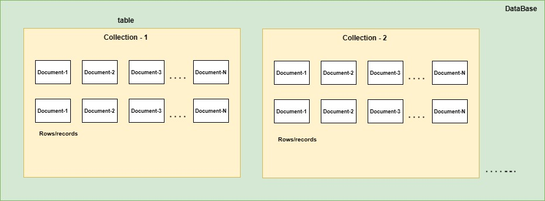
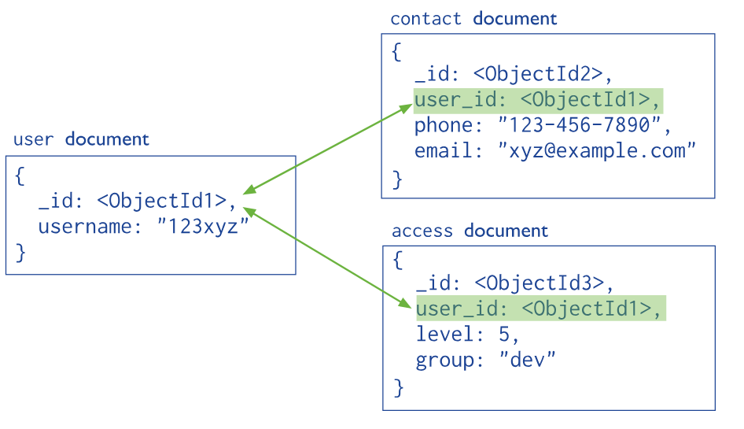
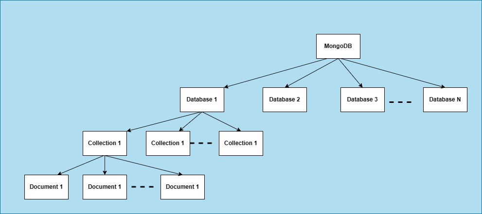
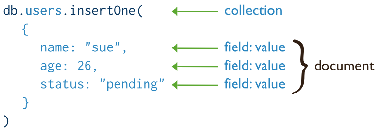
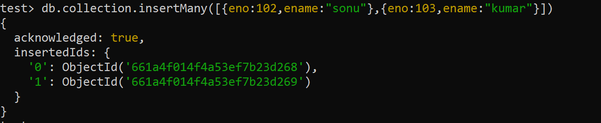

# MongoDB

**Humongous:**
- **extremely large:** Huge a humongous building humongous amounts of money.
- To handle a very huge amount of data if we want a database, then go for mongodb

## Intro

* MongoDB is the most popular and trending database.
* The vendor: MongoDB
- https://www.mongodb.com/

### Where we can use mongoDB
- For desktop applications, for mobile applications
- For web applications, this database is more popular
- Full stack developer

### stack
The technologies which can be used to devlop web application are called a stack.

The most popular stack:
1. MEAN Stack
2. MERN Stack



It is js based web application

#### MERN /MEAN
----
- MongoDB — document database
- Express(.js) — Node.js web framework
- React(.js)/ Angular — a client-side JavaScript framework
- Node(.js) — the premier JavaScript web server



- React / Angular is a frontend framework.
- Express.js is the Backend server framework.
- Node.js is responsible to provide server side runtime environment
- MongoDb is database

> By using MEAN and MEAN Stack, we can build javascript based web application.
1) Node.js is based on javascript
2) React / Angular is based on javascript
3) Express.js is based on javascript
4) MongoDb is based on javascript

***MongoDB internally uses Mozilla's spider Monkey javaScript Engin***

### Q3) What is the type of mongoDB
- It is Document database / NoSQL database
- NoSql = > Not only SQL

 Relational database Vs Document Database
 ------------------------------------
## There are two most common types of databases
1. Relational databases / SQL databases
2. Document databases / NoSql database
---
1. Relational databases/SQL databases
   - The total data sore in the form of table
   - table based on fixed schema eg employee(eno,ename,esal,eaadr)
   - 
   - 

   1. The data will be stored in table, and these tables have fixed schma(structure)
   2. The data stored in tables has relationship like:
      1. one to one
      2. one to many
      3. many to one
      4. many to many
   3. To retrieve data from a relational database, we have to write join queries that collect data from different tables
      - eg Oracle, Mysql etc
2. Document Database / NoSQL Database
   - 
   - Each DB contains multiple collections
   - Inside each collection there are multiple documents
   - Each document is just like a row
   - Our data stored in document such type of db called document oriented or document
   - each document is independent of the other
   1. Data will be stored in separate documents and each document is indecent of others
      - mongodb
   ***it not having fixed schema***

## MongoDB structure
- 
- 
- 
- MongoSB physical database contains several logical database
- Each database contains several collections. Collection is something like table in a relation database.
- Each collection contains several documents. Document is something like record/ row in a relational database
- eg
  - **Database:** Shopping cart database
  - **collections:** Customer, Products, Order
  - Customer Collection Contains several documents

```yaml 
document1:{
         "name": "Sunny",
         "age": 40,
         "salary": 10000,
       }
```

### Q How data represent in mongoDB?
- In JSON (BSON) format
- JSON => JavaScript Object Notation (Biggest advantage of mongo)
- Bson => Binary JSON
- The document will be stored in Binary Form

## Key characters of MongoDB database
----------------------------------
1. All information related to a document will be stored in a single place.
   - To retrieve data, it is not required to perform join operations, hence retrival is very fast
2. Documents are independent of each other and no schema. Hence, we can store unstructured data like video, audio files, etc.
3. We can perform operation lie editing existing document, deleting document and inserting a new document very easily
4. Retrival data is in the form of json which can be understandable ny any programing language without any conversion (Interoperability)
5. We can store a very huge amount of data and hence scalability is more

***Note: performance and flexibility are the biggest assets of mongodb***

## popular NOSQL   
1. MongoDB
2. Cassandra 
3. Elasticsearch
4. Neo4J
5. HBase
6. redis.io

## If we install mongodb, we will get two things:
1. Mongodb shell
2. Mongodb server

These are separate javascript based application

### Mongodb shell Vs Mongodb server
-------------------------------
Once we install Mongodb, we will get Mongodb shell and Mongodb server. These are javascript based application

Mongodb server role
-------------- ----
Store data in Mongodb database.it is responsible to sore our data in database

Purpose of shell
----------------
- Shell can be used to manage mongodb server
- Mongo shell is responsible to manage server
- By using this shell we can perform all required CRUD operation.

- c => create
- R => Read
- U => Update
- D => Delete


- Mongodb server can be either local or remote
- To launch / start mongo server = > Mongod command
- To launch / start mongo shell = > Mongo command

- GUI support is also there for mongodb shell => mongodb compass

### Mongo Driver

If we want to communicate with database special software need like a driver
- From application(C#,python, java,node.js) if we want to communicate with a database some special software must be required which is nothing but driver software

> pymongo is a recommended way to work with MongoDB for python
 
Some shell commands
   ```bash
    show dbs
    show collactions

    db.stats()
    db.version()
    db.help()
   ```
`mongod -version` to perform an operation on server => `mongod --dbpath "c:\data\db"`
- Py mongo is recommended way to work with MongoDB from python
- 27017 => Default Port Number
- mongo.exe/mongosh.exe => shell
- mongod.exe => server
- if we enter mongod in cmd it will get path error ("NonExistentPath - db")
- create a path "c:\data\db"

## Default Database:
MongoDB admin use these default database

`show dbs`
- admin
- config
- local

1. admin
---
-  adminDB is used store user authentication and authorization information like userna,e, passwords roles etc
-  This database is used by adminstrator which creating,deleting and uploading user and while assining roles

2. Config:
---
- To store configuration information of mongodb server like which part its listing

3. local (clone a DB)
---
- Replica
- localDB can be used by admin while performing replication process

***We can store very huge amount of data and hence scalibilty is more***

### Data Formats in MongoDB
-----------------------
JSON : {name: "ashish"} => BSON and that BSON will be storted

### Why BSON
1). In JavaScript only 6 types are available
   1. string
   2. Number
   3. Object
   4. Array
   5. Boolean
   6. Null

   But Bson provides some extra types also like
      - 32 Bit Integer => Numerical
      - ObjectID => JSON =>10kb
      - Date => BSON 4 to 5 kb

2. BSON required less memory

   -  End user / Developer will provide data in json formate
   -  In mongoDb server data will be stored in BSON form

   Note:
   ----
   Efficient storage and extra data types are specicilty of BSON over JSON

   EJSON => Extended JSON
   At the time of retrieval BSON Data will be converted to EJSON for Understend puroperly
   
   
   
   - Insertion of Document / Creation = JSON to BSON
   - Read Operation / Retrieval operation = BSON to JSON

   Q What data formaat used in MongoDB
   - Three (3) Formats JSON, BSON, EJSON


   ### Creation of database and collection
   - Database will be created dynamically
   - Whenever we are creating collection or inserting document then database will be created dynamically

   ### How to create collection
   ```bash
    use ashishDB
   db.createCollection("employees") # Should be camel-case
   ```
   
   ### How to drop collection 
   ```bash
   db.collection.drop()
   db.student.drop()
   ```

   ### How to drop database
   ```bash
    db.dropdatabase()
    db.studentdb.drop() # current database will be deleted
   ```

## Basic CRUD operation in simple way

1. C => Create / Insert document

```bash
   db.collection.inserOne()
   db.collection.inserMany()
   db.collection.insertOne({ name: "Alice", age: 25 })
   db.collection.insertMany([{ name: "Bob", age: 30 }, { name: "Charlie", age: 22 }])

   db.collection.inser()
      Collection.insert() # is deprecated.
```



Additional Methods for Inserts
The following methods can also add new documents to a collection:

   ```bash
      db.collection.updateOne() # when used with the upsert: true option.

      db.collection.updateMany() # when used with the upsert: true option.

      - db.collection.findAndModify() # when used with the upsert: true option.

      - db.collection.findOneAndUpdate() # when used with the upsert: true option.

      db.collection.findOneAndReplace() # when used with the upsert: true option.

      db.collection.bulkWrite().
      db.collection.bulkWrite() # MongoDB provides the ability to perform write operations in bulk.
   ```

2. R => Read / Retrieval operation
   ---------------------------------
   ```bash
   db.collection.find() # To get all documents present in the given collection.<br>
   db.collection.dindOne() # To get one document<br>
   db.find().pretty()
   ```
   
3) Update => Update Operation

```bash
   db.collection.updateOne()
   db.collection.updateMany()
   db.collection.replaceOne()
```
   - Old value will relace with new
   - If Filed is not already there it will create and update operation document must one atomice operation
   $ => predefine `{$set{sal:1000}}`
   
   > Note:
   If anything prefixed with$ symbol, then it is predfine word in MongoDB

4) D => Delete opration
```bash
   db.collection.deleteOne()
   db.collection.deleteMany()
```     
> Note
Datbase and collection will be created dynamically whenever we are creting document.

## Capped Collection

```bash
   db.createCollection(name,options) # p1 = max, size ,document
   db.createCollection("emp",{capped:true, size:3736578,max:100})
```
   - Old document will be deleted automatically Based on time stemp
   - If capped is true meaning that if size exceeds or maximum number of document  reached, then oldest entry will be deleted automatically.

```bash
   db.createCollection("emp") # Normal Collection
   db.createCollection("emp",{capped:true}) # Invalid 
   # without  size,max we cannot created capped collection
   db.createCollection("emp",{capped:true, size:36734543}) # valid
   db.createCollection("emp",{size:3676934})` # Invalid
      #"errorM$g": the capped filed needs to be true eithere thr size or max filed.
   db.createCollection("emp",{capped:true, size:3343455453,max:10000}) # valid
```

### Q What is capped collection?
   
   If size exceeds or maximum numbers of documents reached then oldest entry will be deleted automatically, such type of collection are called capped

By Default in MongoDB there is no schema but we can stil define schema

### Inserting Documents in the collection (C => Create)
```bash
   db.collection.inserOne() # Highly Recommeneded
   db.collection.inserMany() # Highly Recommeneded
   db.collection.inser() # Deprecated
```

1. db.collection.inserOne()
```bash
   db.employee.InsertOne({})`
   # Argument is only one javascript object<br>
   
   db.employee.insertOne({eno:100,ename:"ashish"})`
```
   

2. db.collection.inserMany()
      
- To inset multiple documents we need to pass array of javascript object 
```bash
   db.collection.insertMany([{},{}])
   db.collection.insertMany([{eno:102,ename:"sonu"},{eno:103,ename:"kumar"}])
```
    

3. db.collection.inser()
- To insert either a single document or multiple
```bash
   db.collection.inser({})
   db.collection.inser([{}])
   db.employee.inser()
```
-1.PNG)
   

### Creating Document separtly & inserting into collection
```bash
      var emp = {};
      emp.eno = 7777;
      emp.ename = "SUNNY";
      emp.esal = 7777777;
      mp.eaddr = "yhd";
      emp = { 
            eno: 7777, 
            ename: 'SUNNY', 
            esal: 7777777, 
            eaddr: 'yhd' 
         }
     
      db.employees.insertMany([emp])

      db.employees.insertOne(emp)
      db.employees.insertMany([emp])
      db.employees.insert(emp)
      db.employees.insert([emp])
```


### Inserting Document from JavaScript file


### Inserting Document from JSON file (Mongo Import Tool)
- In JSON file, the data should be in array form make size the data should be of json only

### javaScript vs json

- In JavaScript object, quote symbols for keys are optional but in JSON quote symbols are  mandatory for keys

   db.collection.insertOne(javaScript Object)
   javaScript Object => Quote symbol are optional

- Mongod => Tool to start mongoDB server
- Mongosh => Tool to start MongoDB shell
- MongoImport => Tool to Import documents from JSON file into MongoDB

mongoImport is not available bydefault we have to make avalable mannualy.

Note:
> MongoImport command should be executed from the Command prompt but not from shell

```bash
mongoimport --db database Name --collectionName --fileName --JSON array
```
Note:
> Similerly we can use mongoImport data from csv file

